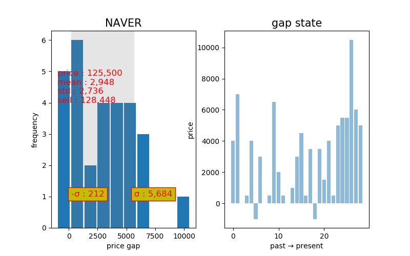

# sigmaGap

종가에 주식을 구매해서 다음날 (최고가 - 종가) 들의 평균값에 판매 할 수 있도록 분석해 줍니다. 

## dependencies

+ numpy
+ matplotlib
+ pandas
+ beautifulsoup4
+ progressbar
+ xlrd
+ lxml

## 스크립트 설명

+ 실행 스크립트 : sigmaGap.py
+ -nb, --nbuy : 살 주식의 총 갯수 **(총 갯수 또는 총 금액 중 1개 반드시 입력 필요)**
+ -m, --money : 살 주식의 총 금액 **(총 갯수 또는 총 금액 중 1개 반드시 입력 필요)**
+ -d, --divide : 분할 투자 갯수 ** 필수 **
+ -t, --txt : 출력할 text 이름을 받습니다. 기본값은 result
+ -r, --rank : 상위 몇 rank 까지 조회할 지를 받습니다. 기본값은 30

## 실행 방법

+ 실행 예제 : 각 기관당 50개씩 4개의 기관에 투자하였을 때를 분석 <br>
```  
python sigmaGap.py -nb=50 -d=4
```

+ 실행 예제 : 총 1,000만원을 4개의 기관에 균등 분산 투자하였을 때를 분석 <br>
```
python sigmaGap.py -m=10000000 -d=4
```

## 그래프 분석 예




## 결과 리포트 예

```
- Celltrion
the number of buying :  11 <br>
money :  2,420,000 <br>
incentive :  59,422 <br><br>

- LG Chem <br>
the number of buying :  7 <br>
money :  2,313,500 <br>
incentive :  31,683 <br><br>

...<br><br>

- AMOREPACIFIC <br>
the number of buying :  13 <br>
money :  2,418,000 <br>
incentive :  49,695 <br><br>

- LG Electronics <br>
the number of buying :  40 <br>
money :  2,488,000 <br>
incentive :  26,779 <br><br>

Total Maximum Incentive :  195,270 <br>
Maximum Incentive List : <br>
Company : Celltrion, Incentive : 59,422 <br>
Company : AMOREPACIFIC, Incentive : 49,695 <br>
Company : NAVER, Incentive : 48,446 <br>
Company : Korea Electric Power, Incentive : 37,707 <br>
```