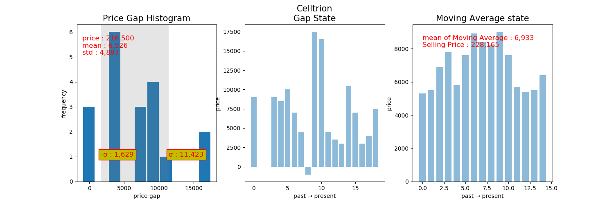

# sigmaGap

+ 종가에 주식을 구매해서 다음날 +α에 판매 할 수 있도록 분석해 줍니다. 
+ α 값은 `Moving Average`를 이용하여 예측합니다.

## dependencies

+ numpy
+ matplotlib
+ pandas
+ beautifulsoup4
+ progressbar
+ xlrd
+ lxml

## 스크립트 설명

+ 실행 스크립트 : sigmaGap.py
+ -m, --money : 살 주식의 총 금액 ** 필수 **
+ -d, --divide : 분할 투자 갯수 ** 필수 **
+ -t, --txt : 출력할 text 이름을 받습니다. 기본값은 result.txt
+ -r, --rank : 상위 몇 rank 까지 조회할 지를 받습니다. 기본값은 30

## 실행 방법

+ 실행 예제 : 총 1,000만원을 4개의 기관에 균등 분산 투자하였을 때를 분석 <br>
```
python sigmaGap.py -m=10000000 -d=4
```

## 그래프 분석 예




## 결과 리포트 예

```
- Celltrion <br>
the number of buying :  2 <br>
cost :  433,000 <br>
prediction by movingAverage :  11,665 <br>
incentive :  23,257 <br>

<br>
...
<br>

- AMOREPACIFIC <br>
the number of buying :  3 <br>
cost :  553,500 <br>
prediction by movingAverage :  5,365 <br>
incentive :  16,045 <br>

Total Maximum Incentive :  39,302 <br>
Maximum Incentive List : <br>
Company : Celltrion, Incentive : 23,257 <br>
Company : AMOREPACIFIC, Incentive : 16,045 <br>
```
